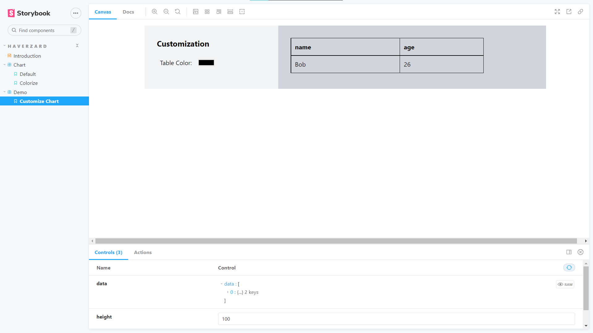

# Dynamic React Plugin

## Description
Proof of Concept for Runtime import on React using Module Bundler. The idea is that you can import a plugin by using the link.

Both rollup and webpack configurations for the dynamic plugin are available in this template.

## Requirements
- NodeJS `v14` or above
- Yarn `1.22` or above

## Installation
`yarn ci`

## Build
- For rollup, use `yarn build-rollup`.
- For webpack, use `yarn build-webpack`.

## Development
You can develop your plugin without the need for React apps using storybook: `yarn storybook`

